# P13: Databases and Plotting

# WARNING: Unless you took a time portal to become my student in the past, this is not the correct repository :) Please go to the correct github repository for the current semester. If you are a Spring'21 semester student though, you are in the right place.

<h2>Corrections/Clarifications </h2>

None yet.


**Find any issues?** Report to us:  

- ABHAY KUMAR <abhay.kumar@wisc.edu>
- YIWU ZHONG  <yzhong52@wisc.edu>

## Learning Objectives

In this project, you will:
- Practice querying a database using SQL 
- Reinforce your knowledge of working with dataframes and creating plots
- Continue practicing good coding style 

## Coding Style Requirements

Remember that coding style matters! **We might deduct points for bad coding style.** Here are a list of coding style requirements:

- Do not use meaningless names for variables or functions (e.g. uuu = "my name").
- Do not write the exact same code in multiple places. Instead, wrap this code into a function and call that function whenever the code should be used.
- Do not call unnecessary functions.
- Avoid using slow functions multiple times within a loop.
- Avoid inappropriate use of data structures. A bad example: use for loop to search for a corresponding value in a dictionary with a given key instead of use `dictname[key]` directly.
- Don't name variables or functions as python keywords or built-in functions. Bad example: str = "23".
- Don't define multiple functions with the same name or define multiple versions of one function with different names. Just keep the best version.
- Put all `import` commands together at the second cell of `main.ipynb`, the first cell should be submission information (netid and etc).
- Think twice before creating a function without any parameters. Defining new functions is unnecessary sometimes. The advantage of writing functions is that we can reuse the same code. If we only use this function once, there is no need to create a new function.
- Don't use absolute path such as `C://Desktop//220`. **You may only use relative path**. When we test your work on a different operating system, all of the test will fail and you will get a 0. Don't panic when you see this, please fix the error and resubmit your assignment. Contact your TA if you need assistance with this task.


# Testing

For answers involving a DataFrame, `test.py` compares your tables to
those in `expected.html`, so take a moment to open that file in your
browser.

`test.py` doesn't care if you have extra rows or columns, and it
doesn't care about the order of the rows or columns.  However, you
must have the correct values at each row/column location shown in
`expected.html`.

For P13, `test.py` is pickier than it has been. In addition to
checking for incorrect answers, it will also check for a few common
kinds of bad coding style. You should look for linting messages at the bottom
of the output, for example:

```
Linting Summary:
  Warning Messages:
    cell: 1, line: 4 - Redefining built-in 'id'
    cell: 1, line: 3 - Reimport 'numpy' (imported line 2)
    cell: 1, line: 5 - Unnecessary pass statement
    cell: 1, line: 2 - Unused import numpy
```

In this case, `test.py` will deduct 1 point per linter message because of
bad style, and at most deduct 10 points. For more information about the linter
as well as how to run the full linter to see all of the automatically generated
advice and feedback, please check out the [linting README](https://github.com/tylerharter/cs301-projects/tree/master/linter).

**Important**: Please make sure your linter works before you submit the project. If it's not working, please go to the office hours.

# Setup

Use the `download` function from [lab-p12](https://github.com/msyamkumar/cs220-s21-projects/tree/main/lab-p12) to pull the data from here (do not manually download): https://raw.githubusercontent.com/msyamkumar/cs220-s21-projects/master/p13/countries.json

and store it in `countries.json`. Once you have created the file, create a Dataframe named `countries` from this file. 


**Warning**: 1. Make sure your `download` function does not download the file if it already exists. The TAs will manually deduct points otherwise. 2. Make sure you use `download` function to pull the data instead of manually download. Otherwise you may get a zero. 

*Hint*: `pd.read_json('countries.json')` will return a DataFrame by reading from
 the JSON file. If the file contains lists of dictionaries, each dictionary will be a row in the DataFrame.

# Introduction

For your final CS 220 project, you're going to continue analyzing the world using the same dataset from the last project.

In this project, you'll dump your DataFrame to a SQLite database.
You'll answer questions by doing queries on that database.  Often,
your answer will be in the form of a plot.  Check these carefully, as
the tests only verify that a plot has been created, not that it looks
correct (TAs will manually deduct points for plotting mistakes).

Create your database by pasting the following cell to your notebook.

```python
import sqlite3
conn = sqlite3.connect('countries.db')
countries.to_sql("countries", conn, if_exists="replace", index=False)

# remember to do conn.close() at the end of your notebook
```

If you named your DataFrame something other than `countries`, tweak the above code to use your variable names.

### Disclaimer: 
This dataset has been taken from the source without any modifications. Any current information in world affairs, including political implications haven't been represented in this dataset accurately. Please consider this as a synthetic dataset and not a real-world representation of the country information.

# Questions

#### #Q1: In our dataset, how many countries are in each continent?

Look at the `Question 1` table in `expected.html`.  Your answer
should be a DataFrame with the same rows and columns.  It should look
like this:

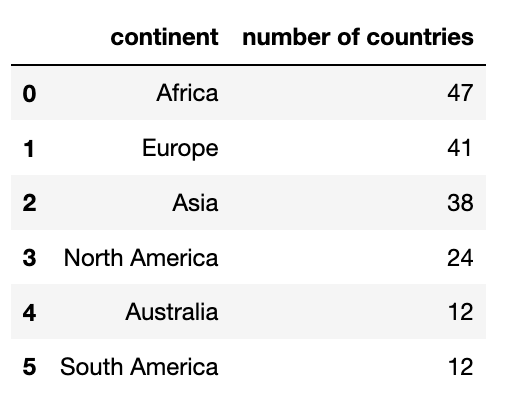

Requirements:
* use a GROUP BY query in SQL
* sort by number of countries (most first)
* break ties alphabetically ("A" before "B", etc)
* the column names should be `continent` and `number of countries`

Use backtick (`` ` ``) around column names with spaces to satisfy the
last requirement.  You should also use the backtics to deal with
column names containing other problematic characters as well (e.g.,
`-`).

#### #Q2: How many countries are in each continent? (answer with a plot)

Answer with a **bar plot**. Put continent on the x-axis and number
of countries on the y-axis. The continent should be sorted along the
x-axis in descending order by the number of countries and then alphabetically by name.

**Expected output:**

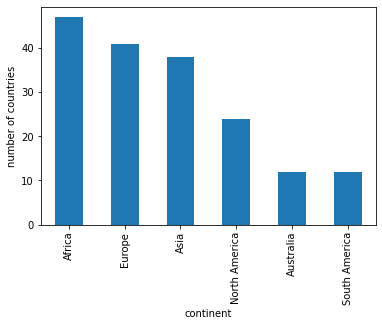

The color doesn't matter. Remember to remove the legend if your plot has the legend (e.g., [ax.get_legend().remove()](https://www.geeksforgeeks.org/how-to-remove-the-legend-in-matplotlib/)).

#### #Q3: What is the total population of each continent?

For this question, you should calculate the total population of every continent
and display the `continent` name and total population of the continent (using a
column named `total population (million)`). The results should be displayed in *descending* order of the
column `total population (million)`.

**Expected output:**

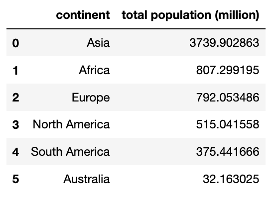

#### #Q4: What is the total population of each continent? (answer with a plot)

Answer with a **bar plot**. Put `continents` on the x-axis and `total population (million)` on the y-axis.  The continents should be sorted along the
x-axis in *descending* order of `total population (million)`.

**Expected output:**

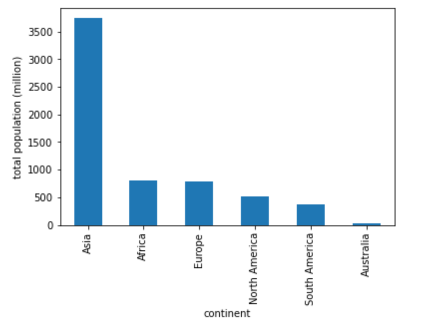

The color doesn't matter. Remember to remove the legend if your plot has the legend.

#### #Q5: What is the population of each country in South America?

You should display the `country` name and `population` of the countries. The results should be displayed in *descending* order of the column `population`.

**Expected output:**

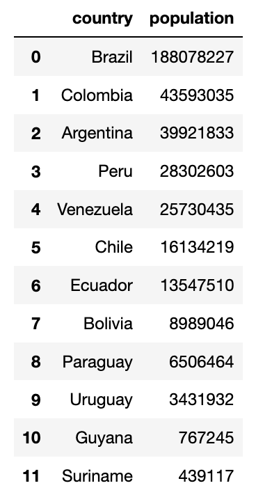

#### #Q6: What are the top 10 countries that have the largest real GDP?

You should display the `country` name and `Real GDP (billion)` of the top 10 countries that have the largest real GDP. These top 10 countries should be
displayed in *descending* order of real GDP.

Hint: `Real GDP = population * gdp-per-capita`

**Expected output:**

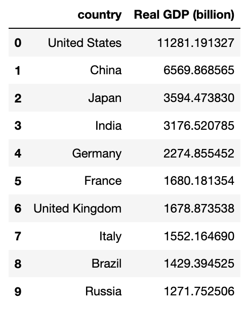

#### #Q7: What are the top 10 countries that have the largest real GDP? (answer with a plot)

Except the top 10 countries, make sure to include the "Other" category (add up the GDP of other countries).

**Expected output:**

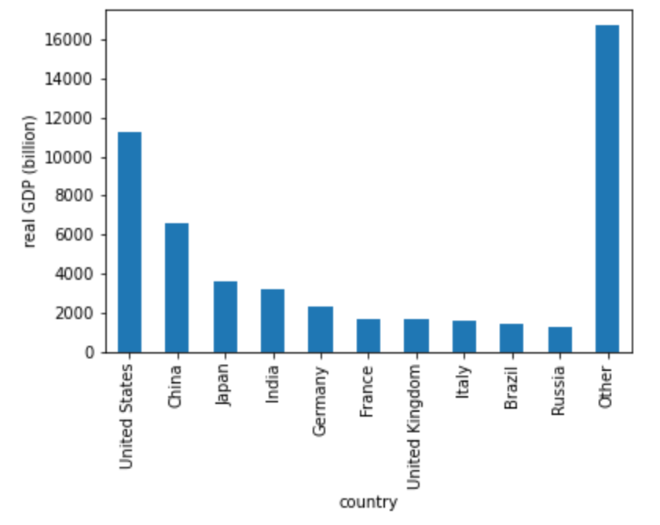

The color doesn't matter. Remember to remove the legend if your plot has the legend. 

#### #Q8: What is the relationship between GDP per capita and literacy?

Answer with a **scatter plot** with `gdp-per-capita` on the x-axis and `literacy` on the y-axis. You will have to convert the type of `literacy` to float.

Optional: Use [Series.apply()](https://pandas.pydata.org/pandas-docs/stable/reference/api/pandas.Series.apply.html) to solve this question without using a for loop

**Expected output:**

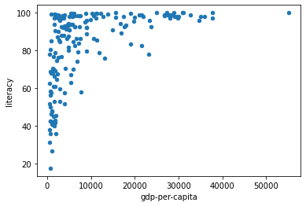


#### #Q9: What is the relationship between GDP per capita and phones?
Answer with a **scatter plot** with `gdp-per-capita` on the x-axis and `phones` on the y-axis. As in question 8 you will have to convert `phones` to float type. 

Optional: Use [Series.apply()](https://pandas.pydata.org/pandas-docs/stable/reference/api/pandas.Series.apply.html) to solve this question without using a for loop

**Expected output:**

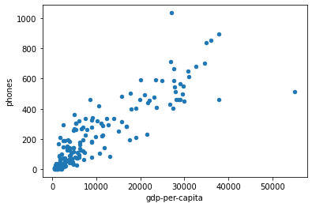

#### #Q10: What is the correlation between GDP per capita and phones?
If you have a DataFrame `df`, then calling `df.corr()` will present a table showing the Pearson correlation between every pair of columns in df. A correlation values of 1 is the max (so, for example, every column is correlated perfectly with itself). A high correlation between columns X and Y means that large X values tend to coincide with large Y values and small X values tend to coincide with small Y values. In some of the questions, you'll observe negative correlations (-1 being the smallest). This means that large X values tend to coincide with small Y values and vice versa.

**Expected output:** (The last few decimals can be different)

`0.8786946640591311`

Don't worry if your result is slightly off. If your result is close enough to the expected output, you will pass the test.

#### #Q11: What is the relationship between GDP per capita and birth rates?

Answer with a **scatter plot** with `gdp-per-capita` on the x-axis and `birth-rate` on the y-axis.

**Expected output:**

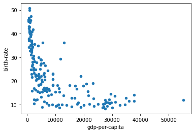

#### #Q12: What is the relationship between GDP per capita and inverse of birth rates?

Answer with a **scatter plot** with `gdp-per-capita` on the x-axis and `inverse birth-rate` on the y-axis.

Hint: `inverse birth-rate` is defined as `1 / birth-rate`

**Expected output:**


#### #Q13: fit a `y = m * x + n` line to the scatter plot in question 12 using the least-squares method; what are the coefficients m and n?

For the regression line, first try copy/pasting this code into a notebook cell and running it to see what happens:

```python
import numpy as np

df = DataFrame({
    "x": [1,2,3,4],
    "y": [2,5,6,5]
})
df["1"] = 1

res = np.linalg.lstsq(df[["x", "1"]], df["y"], rcond=None)

# res is a tuple: (COEFFICIENTS, VALUE, VALUE, VALUE)
coefficients = res[0] # coefficients is (m,n:
m = coefficients[0] # slope
n = coefficients[1] # intercept
ax = df.plot.scatter(x='x', y='y')

df["fit"] = df["x"] * m + n
df.plot.line(x='x', y='fit', c='red', ax=ax)
```

Then adapt the above code so that it uses your DataFrame (instead of
df) and replaces "x" with `gdp-per-capita` and "y" with `inverse birth-rate`. Answer with a **tuple** for coefficients `(m, n)`.

**Expected output:** (The last few decimals can be different)

`(1.8365703926233426e-06, 0.03916624252079352)`

Don't worry if your result is slightly off. If your result is close enough to the expected output, you will pass the test.

#### #Q14: When `gdp-per-capita = 30000`, what is the expected value for `birth rate` according to the regression model from Q13?

**Expected output:** (The last few decimals can be different)

`10.60857644448761`

Don't worry if your result is slightly off. If your result is close enough to the expected output, you will pass the test.

Hint: Estimate `inverse birth-rate` using the regression model from Q13 and then take reciprocal of the output.

#### #Q15: plot the regression line to the scatter plot

To visualize how well the regression line fit the scatter points, draw a fit line over the **scatter plot**.

**Expected output:**

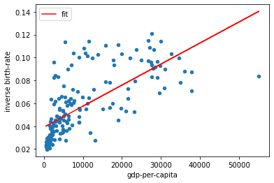

The position of the legend doesn't matter. Make sure the fitted line is red.

#### #Q16: What are the top 15 countries that have the largest gap between birth rate and death rate?

You should display the `country` name, `birth-rate`, and `death-rate` of the top 15 countries that have the largest gap between `birth-rate` and `death-rate`. These top 15 countries should be displayed in *descending* order of the gap (`birth-rate` - `death-rate`).


**Expected output:**

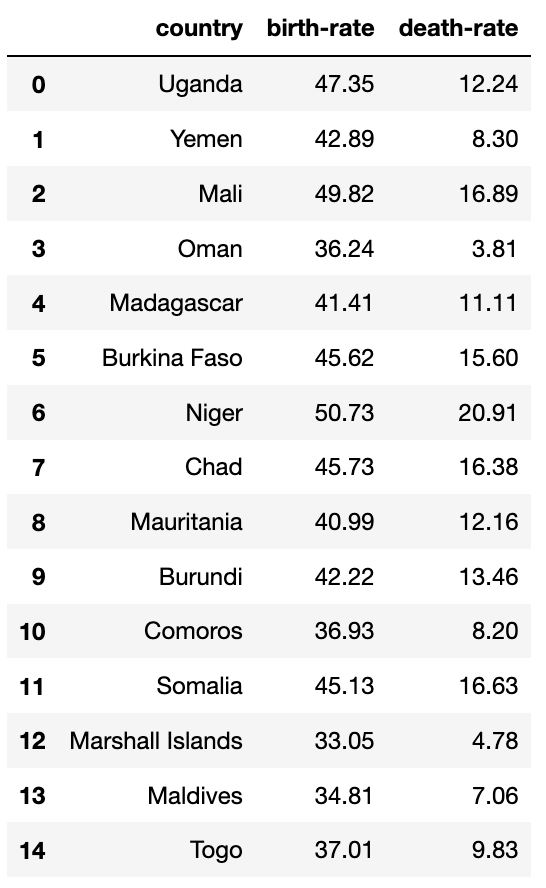


#### #Q17: What are the top 15 countries that have the largest gap between birth rate and death rate? (answer with a plot)

Answer with a **horizontal bar plot**. Put countries on the x-axis and `birth-rate` and `death-rate` on the y-axis. The countries should be sorted along the x-axis in *descending* order of the gap.

**Expected output:**

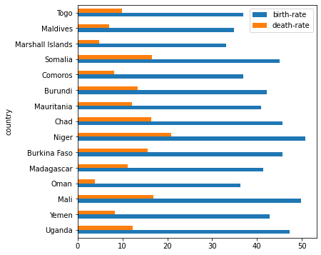

The position of the legend doesn't matter. Make sure the your x-axis ticks are exactly same with the expected output.

#### #Q18: What is the relationship between population and gdp-per-capita? (answer with a plot)

Answer with a **scatter plot** with `population` on the x-axis and `gdp-per-capita` on the y-axis. Do you observe a pattern between population and gdp-per-capita?

**Expected output:**

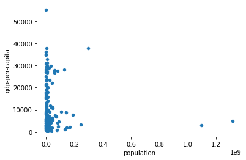

#### #Q19: Did you notice the four outliers? Which countries are they?

These are the points:


You are not required to use any specific algorithm to find the outliers. Write a query to grab rows corresponding roughly to that rectangle to get the points. **Hardcoding the range of values is acceptable for this question.** In the output, `gdp-per-capita` should be sorted in ascending order. 

**Expected output:**


#### #Q20: what are the top 10 countries that have the largest real GDP? (answer with a plot)

Make use of the output of q6. To make the problem more interesting, answer with a **pie chart**. (Hint: use [df.plot.pie](https://pandas.pydata.org/docs/reference/api/pandas.DataFrame.plot.pie.html))

**Expected output:**


The color doesn't matter. 

### WARNING: Close the database connection in the last cell. Not doing this will make autograder fail. Please do this right away and save your precious time. 

### Before turning in:
Be sure to run test.py and make sure there are no errors. If you turn in a version of your code which fails on test.py (i.e. you can't see which questions you got right or not), **we will deduct 5 points**. If the autograder is failing but you still want to turn in, you can see which question it is failing on and comment out the code for that question, essentially leaving it out. 


After you add your name and the name of your partner to the notebook in the first cell, please remember to Kernel->Restart and Run All to check for errors then run the test.py script one more time before submission. To keep your code concise, please remove your own testing code that does not influence the correctness of answers.

